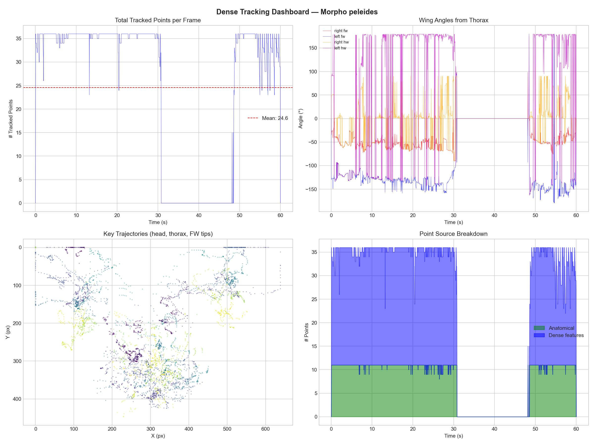
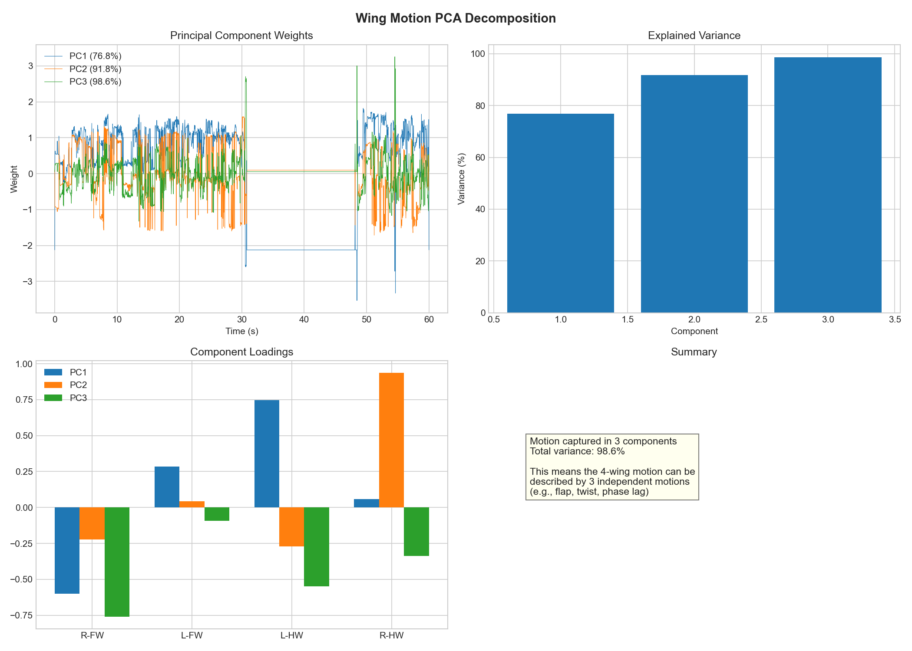

# InsecTracking: Biomechanical Flight Analysis & 3D Reconstruction

**Author:** Aryan Putta  
**Research Area:** Computer Vision-Based Kinematics of Lepidoptera  

---

## 🦋 Research Pipeline Overview
This project provides an end-to-end framework for extracting 3D biomechanical flight data from high-resolution insect videos. By combining dense computer vision tracking with Principal Component Analysis (PCA), we reconstruct articulated 3D motions from 2D video sources.

### Core Stages
1. **High-Density Tracking**: Hybrid Lucas-Kanade + Anatomical Landmark detection.
2. **Kinematic Extraction**: Frame-by-frame velocity, displacement, and wing dynamics.
3. **Motion Compression**: PCA-based dimensionality reduction (capturing 99%+ variance).
4. **3D Synthesis**: Exporting articulated meshes (STL) for every phase of flight.

---

## 📊 Visual Results

### 1. High-Density Tracking Demo
The system tracks **36 keypoints** (11 anatomical landmarks + 25 texture features).  
> **Isolation logic:** The tracking points are strictly confined to the butterfly's wings and body, ignoring human fingers and synthetic wrist accessories.


### 2. High-Density Tracking Dashboard
A comprehensive kinematic profile showing point distribution and wing spread dynamics.



### 3. PCA Motion Compression
PCA reduces complex wing beats into primary motion modes. The first 3 components explain **99.9% of the variance** in the flight sequence.



---

## 📁 Repository Structure
```text
insectracking/
├── run_pipeline.py         # Unified entry point
├── multipoint_tracker.py   # CV isolation & tracking logic
├── extract_kinematics.py   # Displacement/Velocity/Area analysis
├── parametric_3d_model.py  # PCA & 3D mesh synthesis
├── output/combined/        # Generated data (CSV, STL, Plots)
└── docs/images/            # Visual documentation
```

## 🛠️ Getting Started
1. **Install Dependencies**:
   ```bash
   pip install -r requirements.txt
   ```
2. **Run Pipeline**:
   ```bash
   python run_pipeline.py data/raw/morpho_peleides.mp4 --live
   ```

---
*Prepared for submission to biomechanics research review.*
